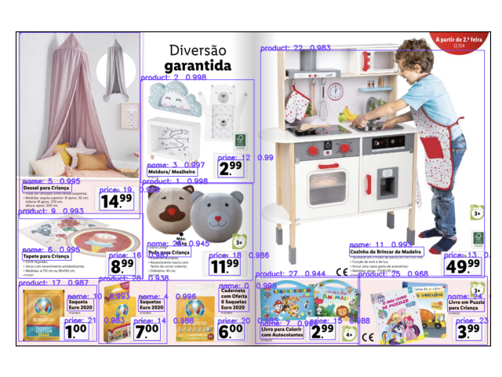

# Fine-Tune Faster-RCNN on a custom promotions flyer dataset using pytorch

Goal: Identify products in a lidl (for now) promotions flyer.



## Usage

__Train the model__
```shell
python3 train.py
```

The model will be `./model/faster-rcnn-promos.pt`

__Model Inference__
Read all products from a image (e.g. screenshot ) of a flyer displays the bounding boxes and saves the products name and the price to a txt file.   

```shell
python3 predict.py --image path/to/test/image

#for example
python3 predict.py --image multiple.jpg
```
__Read Through PDF__
Read all products from a pdf flyer and saves them in a txt file. 

```shell
python3 predict_pdf.py --pdf path/to/pdf

#for example
python3 predict_pdf.py --pdf test-pdf/folheto.pdf
```

__Note__: `utils.py`, `transforms.py`, `coco_eval.py`, `coco_utils.py`, `engine.py` contains helper functions used during training process, and they are adopted from PyTorch Repo.
